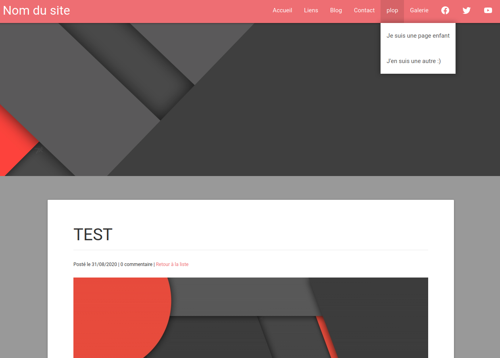

# Material

Un thème simple pour le CMS flat-file 99ko.

## Installation

Télécharger le code, et mettez simplement le dossier *material* du ZIP dans le dossier `theme` de votre installation 99ko. Dans la configuration du site, sélectionnez le thème `Material`, et voilà :)

## Fonctionnalités
* Images de Gravatar pour les commentaires
* Menu responsive (framework CSS Materialize)
* Page 404 personnalisée
* Textes du blog tronqués sur la page d'accueil du blog (liste des posts)
* Plugin SEO automatiquement déplacé dans le menu du header
* Formulaires stylisés

## Screenshots

## Sources

[MaterializeCSS](https://materializecss.com/)

[Icones](https://iconify.design/icon-sets/mdi/)